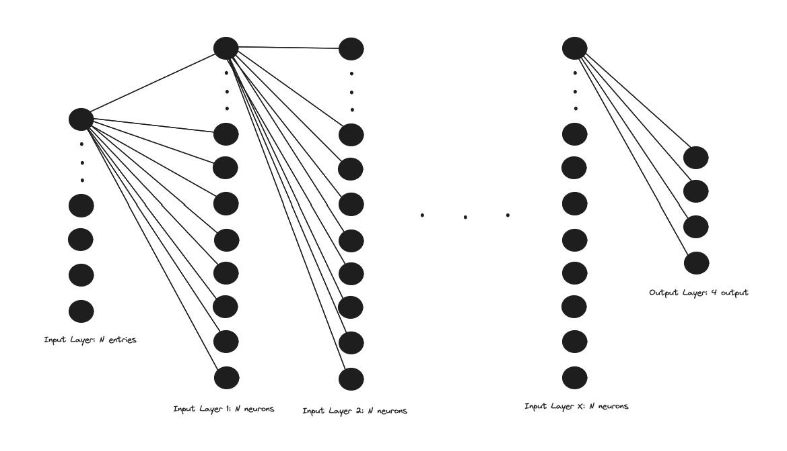
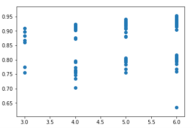
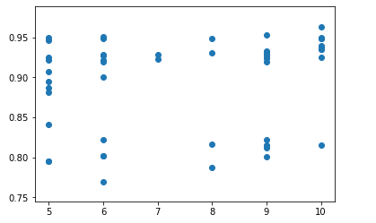

# Pressure_profil_prediction
 Prediction of the pressure profil of an aircraft wing based on deep learning.
 Our goal is to use pressure predictions to prevent aircraft stalls.
 The advantage of deep learning in this case is that it requires very little computation compared with real-time simulations, and delivers rapid results that can be used by pilots or drones in their piloting.
 We are using data coming from the [deepstall project](https://projects.asl.ethz.ch/datasets/doku.php?id=deepstall)

 Model
 

First try

 Hyperparameters optimisation

 

